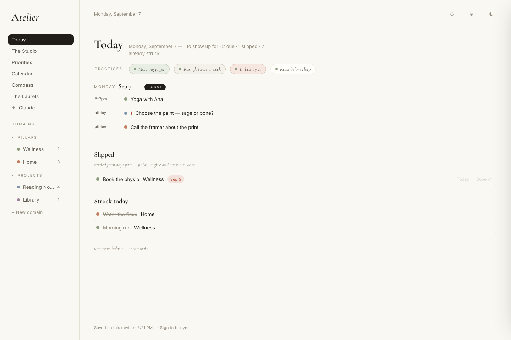
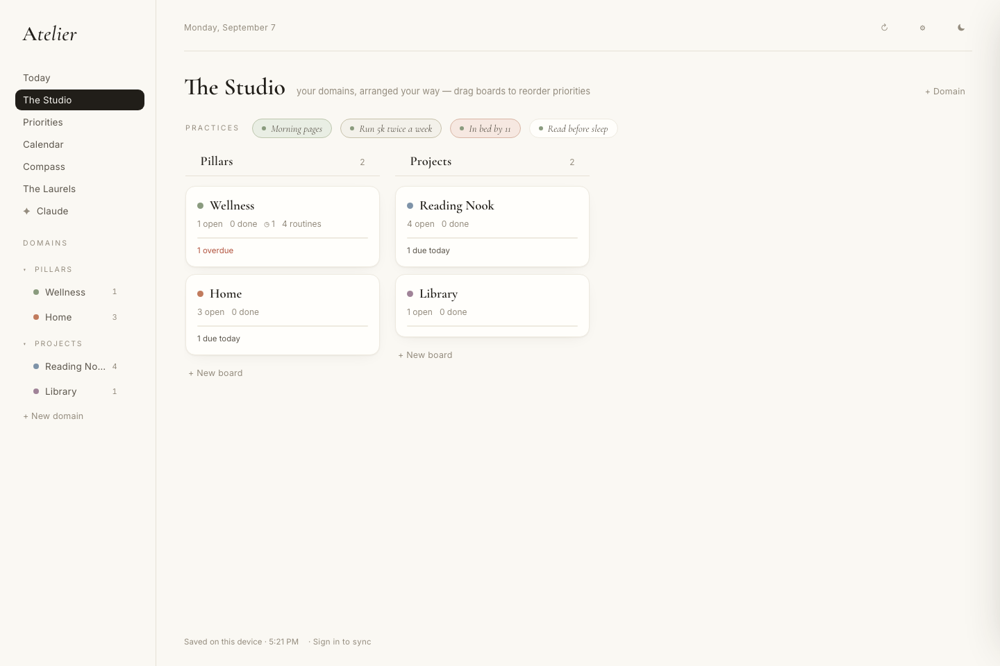
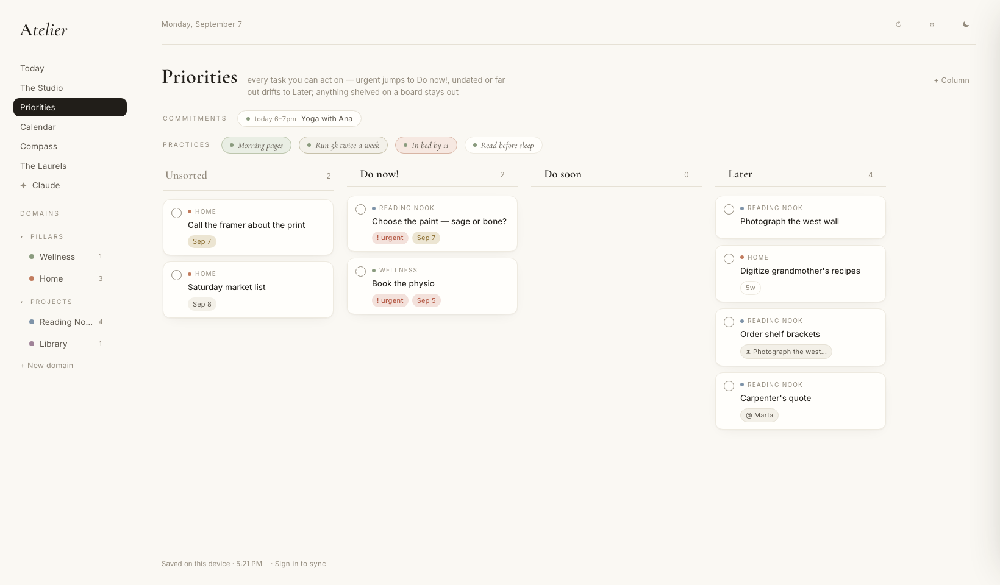
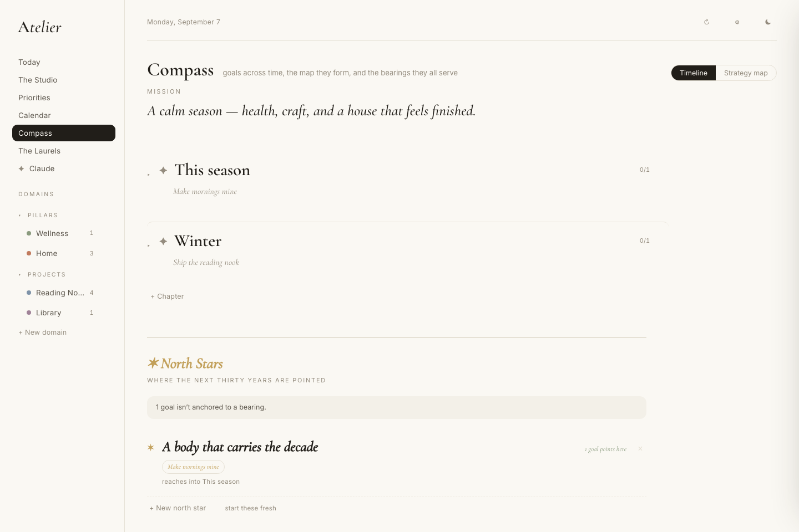

# Atelier

*A quiet, opinionated personal planner — boards, a day, a compass, and an AI
that actually works your lists.*

**Live:** [alexandrapaiz.github.io/atelier-app](https://alexandrapaiz.github.io/atelier-app/)
· 



Atelier is built on a few convictions that most task apps don't hold:

- **The day is the front door.** You land on *Today* — appointments in clock
  order, what slipped (ranked by what actually matters), the front of the
  queue, what you already struck through, and a one-line whisper of tomorrow.
- **Practices aren't tasks.** Routines live in ∞ columns and never complete.
  Once a week the app asks for one honest word per practice — *kept, wobbly,
  let it slip* — and that rhythm, not a streak counter, is the record. A goal
  can be **held by a practice**: a season with an end date, graded by the
  rhythm, frozen at its average when the date arrives.
- **Waiting is a state, not a failure.** A task can wait on another task or on
  a person (`@Papá`). Waiting work dims, sinks, and leaves every "do this now"
  surface — because there is literally nothing you can do — until the blocker
  finishes, the person comes through, or the wait runs long enough to deserve
  a nudge.
- **The ledger only goes up.** Every task is timestamped; finished work
  survives even its board's deletion, wearing the board's name in the Laurels.
- **Typing is the interface.** `gym friday 3pm!` parses date, hour, urgency.
  `\friday` shields a word from the parser. `@name` sets a wait as you type.
  Enter creates the task and keeps the pen in your hand.

## The parts

| Surface | What it is |
|---|---|
| **Today** | The landing page — your day on one sheet |
| **The Studio** | Boards grouped into domains; quiet boards dim and sink |
| **Priorities** | Triage lanes (urgent floats, waiting sinks, boards can opt out) |
| **Calendar** | Month / week / day, Google Calendar events interleaved chronologically |
| **Compass** | Mission → north stars → chapters → goals with measured key results |
| **The Laurels** | Everything finished — kept, counted, celebrated |
| **Claude** | Mission control for the AI: rituals, delegations, the file Tray |

### A look around

| | |
|---|---|
|  |  |
| *The Studio — boards in domains; practice chips tinted by their weekly rhythm (green holds, rust slips)* | *Priorities — urgent floats, waiting sinks to Later with its `@ Marta` and `⧗ blocked-by` chips, a 5-week-old task wears its age* |


*The Compass — mission, chapters, goals with due dates, and a north star with the goal that points at it. A goal here is held by a practice: the morning-pages rhythm is its measure for a season.*

## Claude, as a collaborator

Atelier ships with a hosted [MCP connector](https://atelier-mcp.vercel.app/mcp)
(per-user OAuth — Claude sees only your data). Nearly forty tools cover the
whole surface: tasks, boards, columns, domains, goals, chapters, north stars,
routines and their rhythm, dependencies, delegation, and a file Tray that
turns dropped PDFs into appointments. Ritual buttons in the app hand Claude a
morning brief, an evening close, or a weekly compass review over your live data.

## Architecture

One ~330KB static app (no build step) over Supabase — auth, one jsonb
document per user under RLS, realtime, storage. Sync is offline-first with
per-item freshest-touch-wins merging and tombstoned deletions, so any device
can edit and none can resurrect the past. The plan for multi-user and the
App Store lives in [ARCHITECTURE.md](ARCHITECTURE.md).

```
core/parse.js   the natural-language layer (dates, urgency, shields, @waits)
core/waits.js   dependencies, person-waits, priority ordering
core/merge.js   the sync merge — graves first, then per-item, freshest touch wins
index.html      state, sync, views (splitting further as phase 2 proceeds)
```

## Developing

```bash
python3 -m http.server 8123          # serve locally
npm test                             # 24 tests over the REAL shipped script
```

The test harness (`tests/harness.mjs`) boots the actual application script in
a Node vm with a stub DOM — no extracted copies, no drift. CI runs the suite
on every push.

---

*Built by [Alexandra Paiz](https://github.com/alexandrapaiz), in collaboration
with Claude.*

## Operations

Atelier is a portfolio product of Alexandra Systems Company. Three
agent seats (`prompts/`: pm, engineer, exo) work through PRs under the
company standard (`docs/standards/pm.md`, incl. autonomy tiers) and the
company lessons register (`docs/standards/lessons.md`, synced
autonomously from HQ). SPRINTS.md remains the sprint board of record
and the Weekly compass the ceremony (deviations: `docs/decisions.md`).
Seat crons are commented out until each passes a supervised smoke run.
